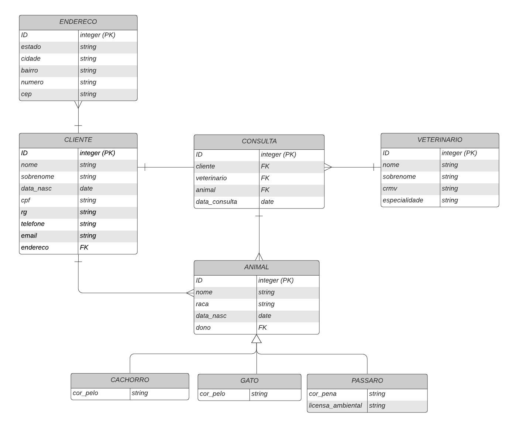

# Tabela de conteúdos
   * [Introdução](#introdução)
      * [Tecnologias utilizadas](#tecnologias-utilizadas)
      * [Entidades](#entidades)
      * [Funcionalidades](#Funcionalidades)
   * [Como utilizar](#Como-utilizar)
      * [Instalando Docker](#Instalando-Docker) 
         * [Instalando Docker no Ubuntu](#Instalando-Docker-no-Ubuntu)
         * [Instalando Docker-Compose no Ubuntu](#Instalando-Docker-Compose-no-Ubuntu)
         * [Instalando Docker e Docker-Compose no Windows](#Instalando-Docker-e-Docker-Compose-no-Windows)
      * [Executando o projeto](#Executando-o-projeto)


# Introdução
O sistema apresentado nesse repositório simula o ambiente de uma Clinica veterinária. Tal sistema é uma API-Rest construída em python, fazendo uso do framework Django.

## Tecnologias utilizadas
- [Djando Framework](https://www.djangoproject.com/)
- [Django Rest Framework](https://www.django-rest-framework.org/)
- [Docker](https://www.docker.com/get-started)
- [Docker Compose](https://docs.docker.com/compose/)
- [Postgresql](https://www.postgresql.org/)


# Entidades
O diagrama Entidade-Relacional abaixo representa a estrutura, os dados (e seus relacionamentos) do projeto.


# Funcionalidades
Os seguintes casos de uso foram satisfeitos por esse projeto:

| Identificador | Descrição  |
|:-------------:|-------------|
| caso_01 | O sistema deve permitir o cadastro, leitura, edição e remoção de Clientes|
| caso_02 | O sistema deve permitir o cadastro, leitura, edição e remoção de Endereços|
| caso_03 | O sistema deve permitir o cadastro, leitura, edição e remoção de Animais|
| caso_04 | O sistema deve permitir o cadastro, leitura, edição e remoção de Veterinários  |
| caso_05 | O sistema deve permitir o cadastro, leitura, edição e remoção de Consultas     |
| caso_06 | O sistema deve permitir o cadastro de superusuários (administradores)     |
| caso_07 | Os superusuários cadastrados podem realizar login e ter acesso a uma visualização privilegiada|

# Como Utilizar

## Instalando Docker
Para utilizar esse projeto é necessário possuir *Docker* e *Docker-Compose* instalados. Essa seção exemplifica algumas maneiras de instala-los, caso ja possua as dependencias instaladas, avançe para a seção [Executando o projeto](##Executando-o-projeto)

### Instalando Docker no Ubuntu
Como desenvolvi a aplicação toda em um sistema Ubuntu 20.04 LTS, abaixo descrevo como realizar a instalação. Entretanto, esses passos também funcionam com outras distros linux baseadas em Debian, assim como Ubuntu.

<br/>
Acredito que a maneira mais simples de instalar as dependências seja através do script oficial de instalação.

1. Execute os comandos
   ```bash
   $ curl -fsSL https://get.docker.com -o get-docker.sh
   $ sudo sh get-docker.sh
   ```

<br/>

2. Verifique se está corretamente instalado com o comando
   ```bash
   $  docker --version
   ```

Se problemas forem encontrados nesse formato de instalação, consulte a documentação oficial.
https://docs.docker.com/engine/install/ubuntu/

### Instalando Docker-Compose no Ubuntu
Os passos abaixo também funcionam para outras distros basiadas em Debian.

1. Baixe o arquivo binário com o comando comandos
   ```bash
   $ sudo curl -L "https://github.com/docker/compose/releases/download/1.29.2/docker-compose-$(uname -s)-$(uname -m)" -o /usr/local/bin/docker-compose
   ```

<br/>

2. Conceda as permissões para que o arquivo binário baixado possa executar
   ```bash
   $  sudo chmod +x /usr/local/bin/docker-compose
   ```
Se problemas forem encontrados nesse formato de instalação, consulte a documentação oficial.
https://docs.docker.com/compose/install/

### Instalando Docker e Docker-Compose no Windows
No Windows existe a ferramenta *Docker Desktop* a qual abrange tanto *Docker* quanto *Docker-Compose*, ou seja, basta insta-la.

1. Acesse https://docs.docker.com/docker-for-windows/install/, realize o download da ferramenta, execute-a e ela instala-rá todas as dependências necessárias.

2. Com a ferramenta instalada, realize um clique duplo sobre o icone gerado e o mesmo será inicializado.

Obs: Por padrão a ferramenta *Docker Desktop* utiliza o *WSL 2* (Subsistema  Linux existente no Windows 10) então certifique-se de que ele esteja funcionando e configurado corretamente.

## Executando o projeto
Com o *git* devidamente instalado, clone o repositório
```bash
git clone https://github.com/ViniciusMarchi/django-restapi-compdist.git
cd django-restapi-compdist
```


Realize o build do projeto
```bash
docker-compose build
```

Inicialize a aplicação
```bash
docker-compose up -d
```
Crie um superusuário (admin)
```bash
docker-compose exec web python manage.py createseruser
```
Acesse a aplicação através do IP localhost `127.0.0.1:8000/` ou `0.0.0.0:8000/`

Para encerrar a aplicação, utilize
```bash
docker-compose down
```